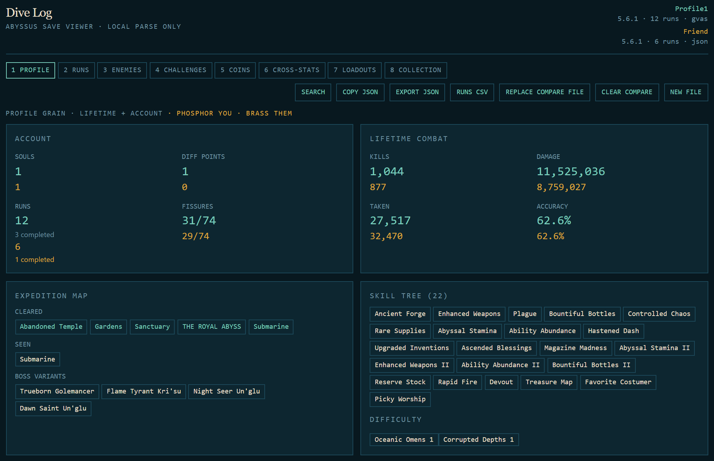
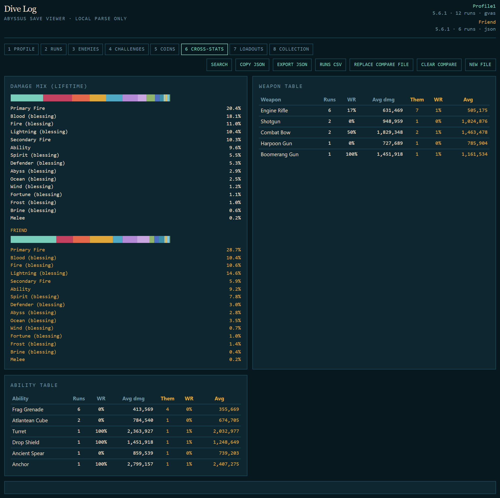
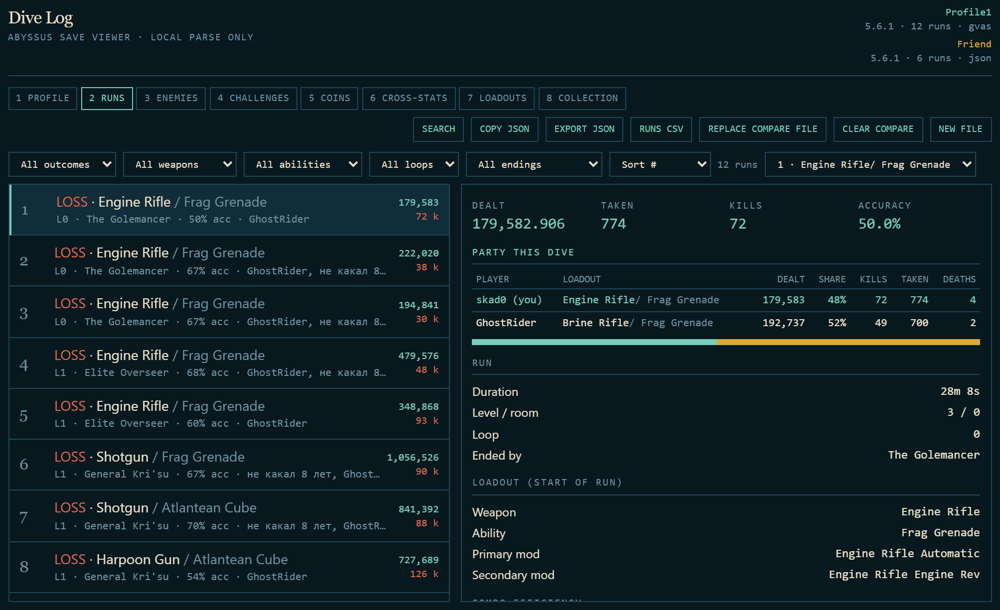
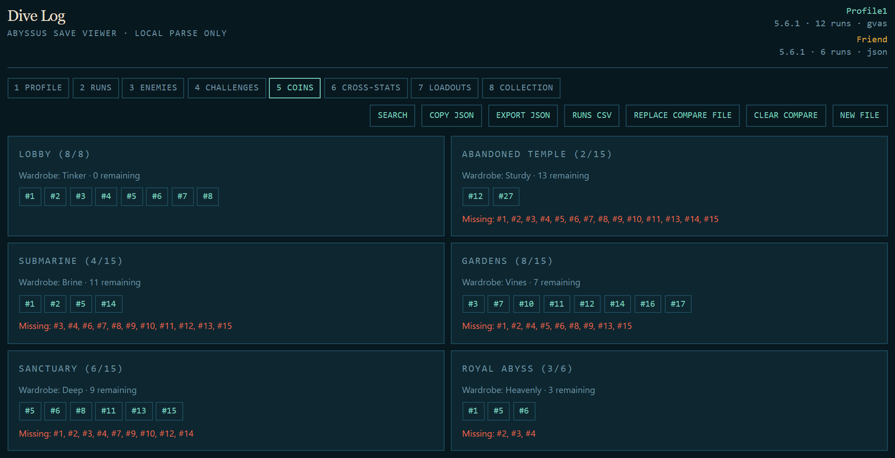

# Abyssus Dive Log

Local viewer for Abyssus `Profile1.sav` (Unreal GVAS) and the thin markdown save report. The file never leaves the browser.

Live: [abyssus.kriant.online](https://abyssus.kriant.online)

```sh
npm install
npm run dev
```

Drop `%LOCALAPPDATA%\Abyssus\Saved\SaveGames\Profile1.sav`. Close the game first. Do not use `GameSettings.sav` or `SAVE_GAME_SESSION_SLOT.sav`.

Contributions welcome — issues and PRs: [github.com/skad0/abyssus-save-explorer](https://github.com/skad0/abyssus-save-explorer)

## Features

Drop a second save (or a friend’s) to compare. Phosphor is you, brass is them.

**You vs them** — profile totals stack side by side.



**Cross-stats** — weapon / ability tables grow Them columns; damage mix sits next to theirs.



**Party this dive** — co-op partners, damage share, loadout. Pin one of their runs next to yours.



**Fissures** — hidden coins found vs missing, by biome.



v1 of this tool lives at `legacy-v1.html` / `legacy/index.html`.

## Render

This is a Vite static app. The CDN must serve **`dist`**, not the repo root. If the live page still loads `/src/main.ts`, the publish directory is wrong.

In the [Render Dashboard](https://dashboard.render.com) → this service → **Settings**:

| Field | Value |
| --- | --- |
| Build Command | `npm ci --include=dev && npm run build` |
| Publish Directory | `dist` |

Then **Manual Deploy → Deploy latest commit**. Vite and Svelte live in `devDependencies`; `--include=dev` is required because Render sets `NODE_ENV=production` during install.

## Assumptions

- Surge Fissure totals come from wiki.gg (Lobby 8, Temple/Submarine/Gardens/Sanctuary 15, Royal Abyss 6). Room names are not in the save.
- Challenge targets are unknown except binary win/unlock/boss/mastery flags. Sample-profile counters are not treated as goals.
- `DamageSource.God.Gold` is Fortune. There is no ally-amp tag in current saves.
- Weapon / ability / aspect blurbs are baked from wiki.gg and a community aspect guide (2026-08-18). Drop Shield = Brine Field, Ancient Spear = Smiting Spear, Atlantean Cube = Ancient Core.
- Combo efficiency is measured against *your* runs (DPS, dealt/taken, vs profile mean). Catalog synergies are hints, not a meta tier list.
- `SoulFragments` may be missing from GVAS; the markdown report lists 31 for this profile.
